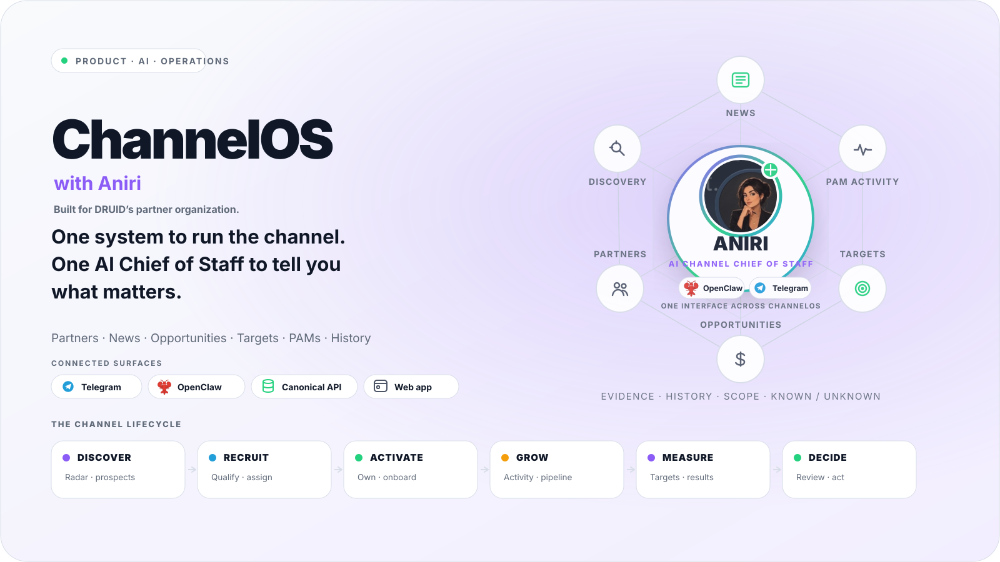
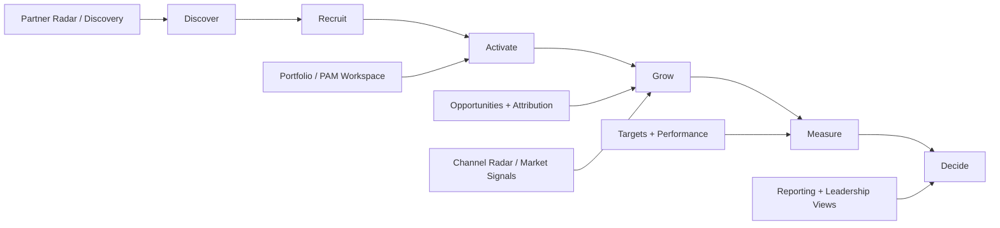
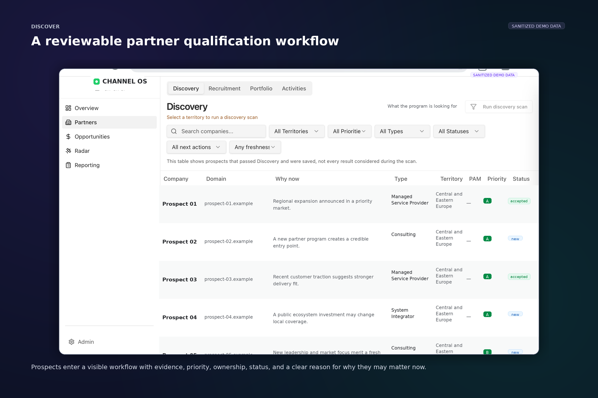
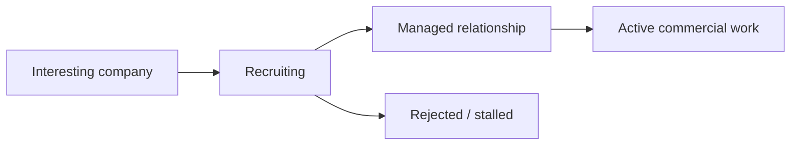
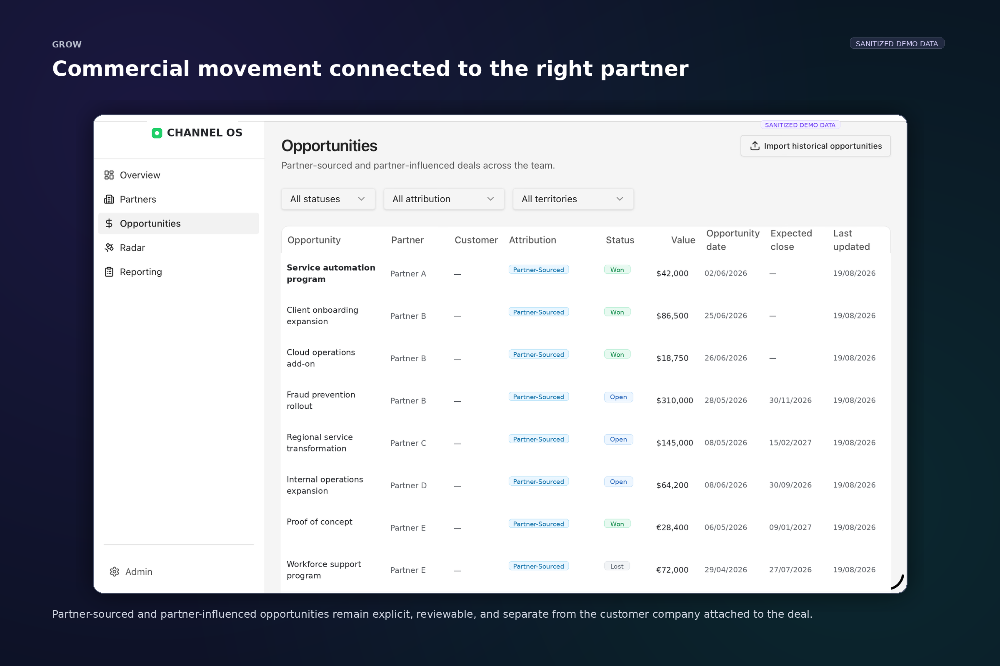
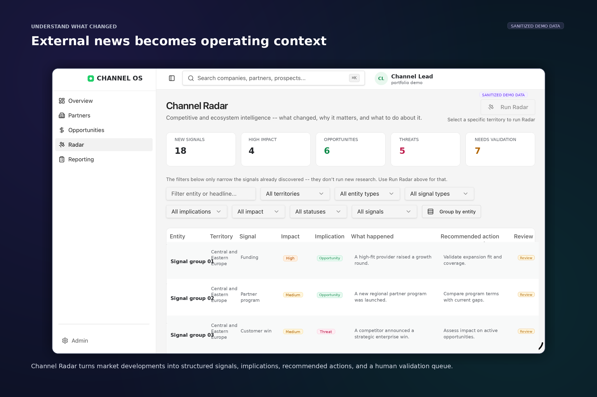
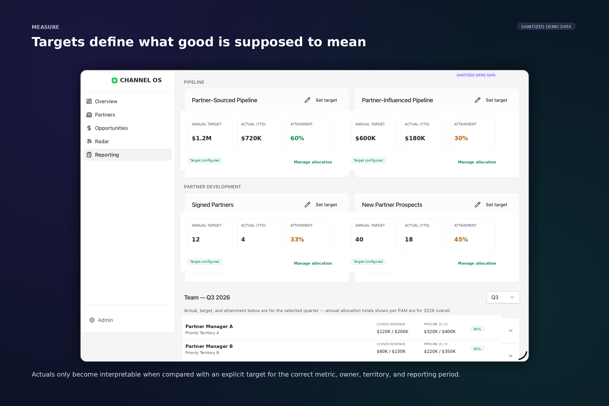
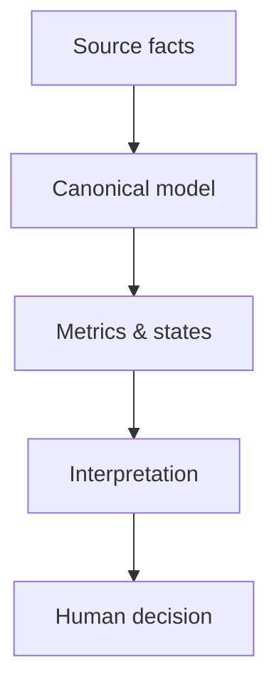
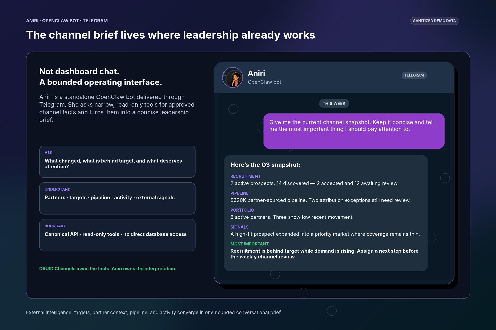
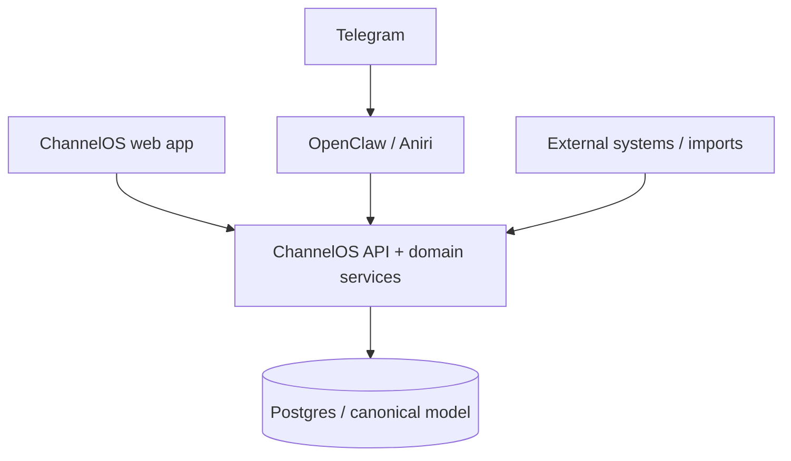

  <picture>
    <source media="(prefers-color-scheme: dark)" srcset="./assets/readme/hero-dark.svg">
    
  </picture>

# ChannelOS

### **An AI-native operating system for a partner organization**

**Discover → Recruit → Activate → Grow → Measure → Decide**

*Built for DRUID’s partner organization. Public portfolio presentation of a real internal product direction.*

---

## What it is

I started this as **Partner Radar** because I wanted a better answer to one simple question:

> **Which companies should a channel team actually care about?**

That part was useful, but incomplete.

The moment a good company appeared, the harder questions showed up:  
**Do we already know them? Who owns the relationship? Are we recruiting them, already working with them, or neither? What changed? Is pipeline actually attributable to the partner? Are we on target? What should leadership pay attention to?**

**ChannelOS is the product that grew around those questions.**

It brings **partner discovery, recruitment, relationship management, market intelligence, opportunities, targets, performance, PAM execution, and reporting** into one operating system.

---

## The product at a glance

| Area | What it does |
|---|---|
| **Discovery** | Finds companies worth a second look and keeps “interesting prospect” separate from “actual partner.” |
| **Portfolio** | Tracks relationship state, ownership, people, research, and partner context. |
| **Opportunities** | Connects commercial movement to partners without blurring customer, partner, and attribution roles. |
| **Channel Radar** | Turns external events and news into usable channel context instead of a generic feed. |
| **Targets & Performance** | Compares actuals against explicit expectations, scopes, owners, and periods. |
| **PAM Workspace** | Gives partner managers a focused operational view instead of making them live in leadership reporting. |
| **Reporting** | Makes the same underlying truth readable for operators and leadership. |
| **Aniri** | Adds a conversational Chief-of-Staff layer across the system through OpenClaw + Telegram. |

---

## The product in five screens

### 1) Find the right partners

Discovery is where the original Partner Radar idea still lives.

The goal is not just to surface companies. It is to surface companies with enough context to support an actual decision.

  

---

### 2) Understand the relationship

A company being interesting is not the same thing as being a partner.

ChannelOS keeps recruitment, relationship state, ownership, and working context visible so the team knows where things actually stand.

---

### 3) Connect commercial outcomes

Opportunities are useful only if attribution is believable.

ChannelOS keeps **partner**, **customer**, **attribution type**, **value**, **status**, and **timing** reviewable instead of collapsing them into one flattering pipeline number.

  

---

### 4) Read the market

A funding round, launch, acquisition, leadership change, or new alliance matters only if it changes the commercial picture.

That is why Channel Radar exists.

  

---

### 5) Measure against actual expectations

Performance is not just a number. It only means something when the product knows the **target**, **owner**, **period**, and **scope** it should be compared with.

  

---

## What makes the product credible

The part I care about most is not the AI.

It is whether the system can stay truthful when the underlying data is messy.

- **Missing target ≠ zero target**
- **Unknown partner ≠ no partner**
- **A company on a deal ≠ the attributable partner**
- **Recent news ≠ relevant signal**
- **AI interpretation ≠ fact**

That sounds small. It changes the entire product.

---

## Where Aniri fits

**Aniri is part of the product, not the whole product.**

She is a standalone **OpenClaw bot** exposed through **Telegram** and acts like a channel Chief of Staff across ChannelOS.

Her job is to:

- read approved context through narrow tools;
- explain what changed;
- connect signals, pipeline, targets, and partner context;
- highlight weak spots or uncertainty;
- and help leadership focus.

  

> **ChannelOS owns the facts. Aniri helps interpret them. Humans make the decisions.**

---

## Architecture

The web app and Aniri feel different, but they meet the same underlying system:

- **one canonical domain model**
- **explicit role and authority boundaries**
- **AI layered on top of trusted services, not in place of them**

---

## Before / after

| Before | With ChannelOS |
|---|---|
| Research lives in tabs, docs, and memory | Context accumulates around the company |
| Discovery creates another list | Discovery enters an operating workflow |
| Pipeline attribution can look plausible while being wrong | Ambiguity becomes visible and reviewable |
| Performance is discussed as a raw number | Actuals are compared with explicit targets |
| Leadership reconstructs the story by hand | Reporting and Aniri draw from the same shared picture |

---

## Why this is in my portfolio

I work in product marketing, and ChannelOS was my way of making myself earn stronger opinions about how these systems should actually be built.

What I like about this project is not just that it works as software. It is that it forced product thinking, data modeling, UX, AI boundaries, and commercial reality to exist in the same system.

It is easy to say **“partner operating system”** on a slide.

It is harder — and much more interesting — when the product has to decide whether a company is just a prospect, a recruited partner, a managed relationship, an opportunity source, or none of those yet.

---

## Go deeper

<strong>Why the truth model matters</strong>

 

A lot of internal products look trustworthy because they always produce an answer.

I wanted ChannelOS to be trustworthy for the opposite reason: it is allowed to leave some things unresolved.

That is why unknowns are modeled explicitly, ambiguous opportunity attribution can remain under review, and missing targets do not quietly become zeros just to make a chart render nicely.

<strong>Why Aniri exists separately from the web app</strong>

 

I did not want “chat with your dashboard.”

Aniri exists as a separate OpenClaw bot because that makes the authority boundary clearer. She talks through bounded tools rather than acting like a magical interface with direct access to everything.

That makes the AI layer more useful and much safer.

<strong>What this project demonstrates</strong>

 

- product strategy that survives implementation;
- turning a narrow wedge product into a broader operating model;
- designing around uncertainty instead of hiding it;
- combining AI with explicit authority boundaries;
- building a product story that is backed by real product decisions.

---

## Related projects

- **AI Agent Sudo** — a tiny provider-neutral authorization layer for AI agents.
- **VoiceWire** — a local diagnostic engine for voice AI systems that fuses packet evidence with agent traces.
- **Mission Control** — a GTM signal and account-operating system for DRUID.

---

  <strong>Mihail Lupu</strong> 
  Product marketer. Occasionally I get curious enough to build the thing I am trying to explain.

