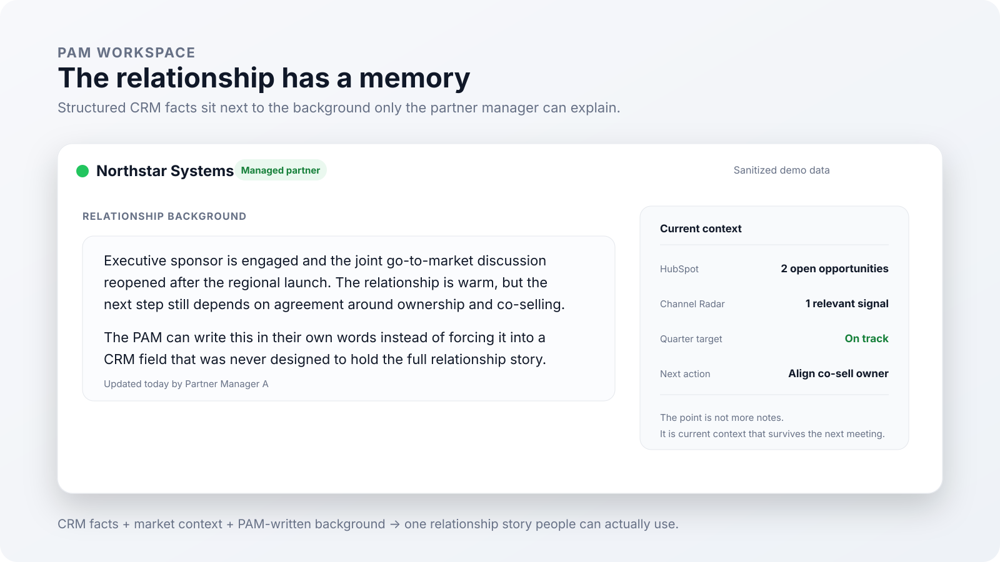
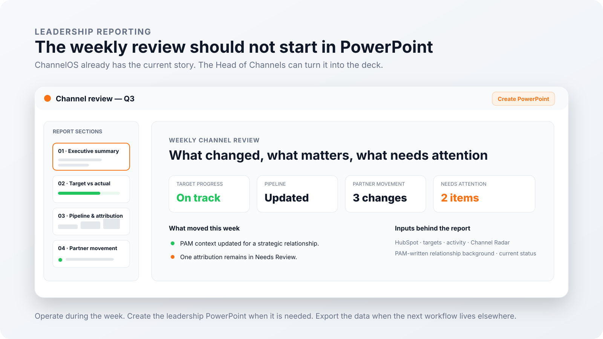
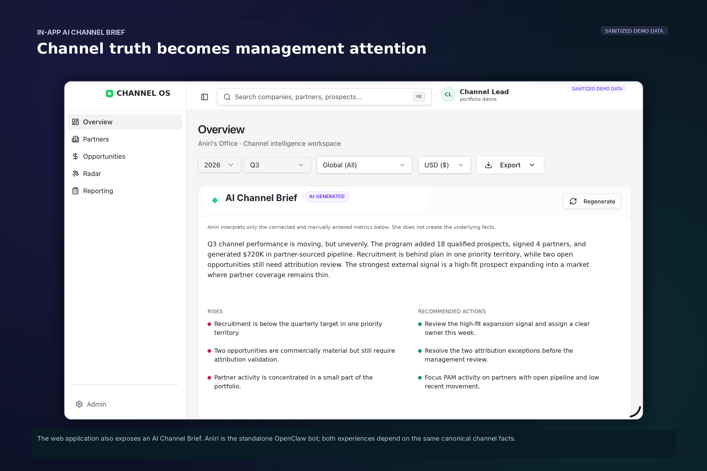

  <picture>
    <source media="(prefers-color-scheme: dark)" srcset="./assets/readme/hero-dark.svg">
    
  </picture>

# ChannelOS

### **An AI-native operating system for a partner organization**

**Discover → Recruit → Activate → Grow → Measure → Decide**

*Built for DRUID’s partner organization. Public portfolio presentation using sanitized product visuals.*

---

## Why I built it

I started with a smaller project called **Partner Radar** because I wanted a better answer to one question:

> **Which companies should a channel team actually care about?**

Finding candidates was useful, but it immediately exposed the harder work around them. **Do we already know this company? Who owns the relationship? Are we recruiting them or already working with them? What does the PAM know that never made it into the CRM? Did anything important change recently? Is pipeline actually attributable to the partner? Are we on target? What does leadership need to know this week?**

ChannelOS grew around those questions.

It is an operating layer for the partner organization: **discovery, recruitment, relationship context, HubSpot opportunity context, market intelligence, attribution, targets, PAM execution, reporting, exports and AI-assisted decision support**.

It is not a CRM replacement. **HubSpot remains the CRM. ChannelOS adds the channel operating context around it.**

---

## Find companies worth a second look

The original Partner Radar idea still lives inside Discovery.

The goal is not to generate the longest possible list. It is to surface companies with enough evidence to support an actual decision: **ignore it, investigate it, assign it, recruit it, or recognize that the relationship already exists**.

  

A discovered company is a candidate, not an automatically-created partner. Keeping that distinction explicit stops discovery metrics, recruitment state and partner counts from quietly collapsing into the same flattering number.

---

## Keep the relationship memory that CRM fields miss

This became one of the most important parts of the product.

HubSpot can hold structured CRM facts. It does not automatically know the full background of a partner relationship: what has happened over the last few months, who matters internally, why momentum stalled, what was promised, what the partner is trying to achieve, or what the PAM thinks should happen next.

So ChannelOS lets PAMs **write that background in their own words** alongside the structured record. Their context stays next to current activity, opportunity data, market research, targets and history instead of disappearing into a separate document or the next status call.

  <picture>
    <source media="(prefers-color-scheme: dark)" srcset="./assets/readme/pam-context-dark.svg">
    
  </picture>

The point is not to create a prettier notes field. It is to preserve **relationship memory** so the next review starts with context rather than reconstruction.

---

## Use HubSpot without pretending HubSpot is the whole operating model

ChannelOS treats HubSpot as an important source of CRM and opportunity context, but the partner organization needs a different layer around that record.

An opportunity may contain a customer, a partner, several contacts, historical associations and a company name that happens to resemble another company. ChannelOS keeps **partner, customer, attribution type, value, stage, status and timing** separately reviewable so commercial reporting does not depend on plausible-looking joins.

  

When the evidence is not strong enough, the product can say **Needs Review**. That is more useful than turning ambiguity into a number everyone trusts because it appears in a dashboard.

---

## Read the market without building another news feed

Partner data ages quickly. A company that looked mildly interesting three months ago can announce an expansion, launch a complementary product, acquire another business, hire a new leader or form an alliance that changes the commercial picture.

Channel Radar connects those external developments back to the companies and relationships ChannelOS already knows about.

The useful question is not **“what happened today?”** It is **“did anything happen that should change how we think about this company, partner or market?”**

  

A recent article is not automatically an important signal. The product can preserve the developments that add commercial context and let the rest remain noise.

---

## Set expectations before judging performance

A number without a target is just a number.

The same pipeline figure can be excellent, disappointing or irrelevant depending on the PAM, territory, metric, period and expectation it is being compared with. ChannelOS keeps the target explicit and evaluates the current result against the correct scope.

  

Targets give PAM reviews, performance analysis, leadership reporting and Aniri a shared definition of what **on track** is supposed to mean. And if no target exists, the product does not quietly convert that into a zero target.

---

## The weekly review should not start in PowerPoint

This is one of the parts of ChannelOS I value most because it connects the operating product to a very ordinary piece of executive work.

A Head of Channels still needs to report upward. Without a shared operating system, that often means opening HubSpot, checking spreadsheets, rereading messages, asking PAMs what changed, finding the latest targets and then rebuilding the story in PowerPoint.

ChannelOS already has that current picture: **targets, actuals, opportunity movement, attribution state, partner context, PAM-written background, relevant market changes and items that need attention**. The Head of Channels can use the same current information to create the PowerPoint report instead of reconstructing it from scratch.

  <picture>
    <source media="(prefers-color-scheme: dark)" srcset="./assets/readme/leadership-reporting-dark.svg">
    
  </picture>

That makes reporting an **output of operating the system**, not a second shadow system maintained for Friday meetings.

The same idea applies to exports more broadly. ChannelOS does not need to own every downstream workflow. Useful data can leave the product when analysis, review, sharing or the next operational process needs to happen somewhere else.

> **Operate in ChannelOS. Create the leadership report when it is needed. Export the data when the work needs to continue elsewhere.**

---

## Two AI surfaces, two different jobs

AI is useful here, but it is deliberately not the center of the product.

The **in-app Channel Brief** gives someone a fast interpretation inside the operating workspace. **Aniri** is a standalone OpenClaw bot delivered through Telegram that gives leadership a conversational way to ask questions across approved ChannelOS context.

<table>
<tr>
<td width="50%" valign="top">

 <strong>In-app Channel Brief</strong> — interpretation inside the operating workspace.
</td>
<td width="50%" valign="top">

 <strong>Aniri</strong> — a standalone OpenClaw bot used through Telegram.
</td>
</tr>
</table>

Aniri does not get magical access to the system. She reads approved context through narrow tools, explains what changed, connects signals across areas and helps leadership focus.

> **ChannelOS owns the facts. Aniri helps interpret them. Humans decide what happens next.**

---

## A few product decisions that became load-bearing

The harder parts of ChannelOS were rarely the screens themselves. They were the definitions underneath them.

| Situation | ChannelOS does not quietly assume... |
|---|---|
| No target has been configured | The target is zero. |
| A company appears on an opportunity | It is the attributable partner. |
| Relationship state is unknown | There is no relationship. |
| A recent article exists | It is commercially important. |
| A PAM writes qualitative context | It came from HubSpot or an external source. |
| AI produces a persuasive interpretation | The interpretation is a business fact. |

The goal is not to make the system timid. It is to keep **source facts, human knowledge, derived metrics, AI interpretation and human decisions** distinguishable while still producing something useful enough to operate from.

---

## What changed for the team

| Before | With ChannelOS |
|---|---|
| Partner research lives across tabs, CRM fields, documents and people’s memory. | Context accumulates around the company and relationship. |
| Discovery creates another list to maintain. | A useful company can move into explicit recruitment and ownership. |
| Valuable PAM knowledge disappears into calls and weekly updates. | PAMs preserve the relationship background in their own words. |
| News is read and forgotten. | Relevant external change becomes persistent partner and market context. |
| Pipeline attribution can look plausible while being wrong. | Ambiguity becomes visible review work. |
| Performance is discussed as a raw number. | Actuals are compared with explicit targets, owners, periods and scopes. |
| Weekly PowerPoint reporting is rebuilt from several sources. | The current operating picture can become the leadership report. |
| Useful data gets trapped in the internal tool. | Exports let the work continue in the next workflow. |
| AI is bolted onto a dashboard. | AI reads controlled commercial context through bounded interfaces. |

---

## The technical shape

The implementation behind this case study uses a modern TypeScript web stack with a React application, an Express API, PostgreSQL, explicit API contracts and validation, external research/AI providers, HubSpot context, reporting/export services, and a separate OpenClaw tool surface for Aniri.

The framework choices are less interesting to me than the boundaries:

- the **company and relationship model** is shared across workflows rather than recreated per screen;
- HubSpot remains an external CRM source rather than being confused with the full channel operating model;
- **role and scope rules** live below the presentation layer;
- external evidence and PAM-written context keep their provenance;
- **reporting, PowerPoint output and exports** read the same operating model used by the product;
- AI consumes controlled context instead of becoming a shortcut around the domain model;
- Aniri uses **narrow tools** rather than direct database access.

The production implementation remains private. This repository is intentionally a **portfolio case study**, not a public copy of internal employer software. Screenshots and illustrative visuals are sanitized and use demo/synthetic presentation data.

---

## Why this is in my portfolio

I work in product marketing, and projects like ChannelOS are how I make myself earn stronger opinions about technical products.

I do not find “marketer who can code” particularly interesting as an identity. The useful part is getting close enough to the system that product decisions, architecture choices, UX trade-offs and positioning stop being abstract.

ChannelOS started as a fairly normal partner-discovery idea and kept expanding because every implementation decision exposed another product question. That is exactly why it belongs here.

> **Understanding the system makes the product story better. Building the system makes the opinions harder to fake.**

---

## Related projects

- **AI Agent Sudo** — a small provider-neutral authorization layer that returns `allow`, `deny` or `require_approval` before an AI agent executes a tool.
- **VoiceWire** — a local diagnostic engine for voice AI systems that combines packet/media evidence with agent traces to localize latency and failure boundaries.
- **Mission Control** — an account-centric GTM signal and operating system built around evidence, prioritization and human-supervised action.

---

  <strong>Mihail Lupu</strong> 
  Product marketer building technical products to understand them properly.

